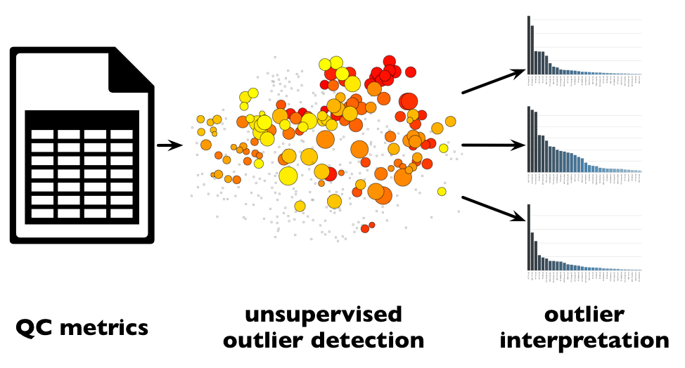

Analysis of mass spectrometry proteomics quality control metrics
================================================================



For more information:

* [Official code website](https://github.com/bittremieux/qc_analysis)

This tool analyzes the quality of mass spectrometry proteomics experiments based on their quality control metrics.

If these techniques are useful for your work, please cite the following publication:

* Bittremieux, W., Meysman, P., Martens, L., Valkenborg, D., and Laukens, K. **Unsupervised quality assessment of mass spectrometry proteomics experiments by multivariate quality control metrics.** *Journal of Proteome Research* (2016). doi:[10.1021/acs.jproteome.6b00028](http://pubs.acs.org/doi/abs/10.1021/acs.jproteome.6b00028)


The software is available as open-source under the Apache 2.0 license.

Application
-----------

	usage: qc_analysis.py [-h] [--min_var MIN_VAR] [--min_corr MIN_CORR]
						  [--scaling_mode {robust,standard}] --k_neighbors
						  K_NEIGHBORS [--distance DISTANCE]
						  [--min_outlier MIN_OUTLIER] [--num_bins NUM_BINS]
						  [--min_sup MIN_SUP]
						  file_in file_out

	Mass spectrometry quality control metrics analysis

	positional arguments:
	  file_in               the tab-separated input file containing the QC metrics
      file_out              the name of the output file (.html extension for HTML
                            export (default), .qcml extension for qcML export

	optional arguments:
	  -h, --help            show this help message and exit
	  --min_var MIN_VAR, -var MIN_VAR
							metrics with a lower variance will be removed
							(default: 0.0001)
	  --min_corr MIN_CORR, -corr MIN_CORR
							metrics with a higher correlation will be removed
							(default: 0.9)
	  --scaling_mode {robust,standard}, -scale {robust,standard}
							mode to standardize the metric values (default:
							robust)
	  --k_neighbors K_NEIGHBORS, -k K_NEIGHBORS
							the number of nearest neighbors used for outlier
							detection and interpretation
	  --distance DISTANCE, -dist DISTANCE
							metric to use for distance computation (default:
							manhattan) ny metric from scikit-learn or
							scipy.spatial.distance can be used
	  --min_outlier MIN_OUTLIER, -o MIN_OUTLIER
							the minimum outlier score threshold (default: None) if
							no threshold is provided, an automatic threshold is
							determined
	  --num_bins NUM_BINS, -bin NUM_BINS
							the number of bins for the outlier score histogram
							(default: 20)
	  --min_sup MIN_SUP, -sup MIN_SUP
							the minimum support for subspace frequent itemset
							mining (default: 5) positive numbers are interpreted
							as percentages, negative numbers as absolute supports

The only **required** parameters are the QC metrics input file, the output file, and the number of neighbors used for detecting and interpreting outlying experiments (`--k_neighbors` / `-k`).

The other parameters are optional and can be used to optimize the analyses, however, the default values should function adequately in most situations.

Input file format
-----------------

The input file must be a tab-separated file containing the QC metrics, and must adhere to the following format:

	Filename		StartTimeStamp		Metric0		Metric1		...		MetricN
	filename0		date0				value		value		...		value
	filename1		date1				value		value		...		value
	...

The first row contains the headers, the subsequent rows each contain the metrics for a single experiment. Columns are separated by tabs and the column values should not contain spaces.

The first two columns containing the filename and the experiment date are **mandatory**, and the filenames should be unique. Furthermore, the headers for these two columns need to be 'Filename' and 'StartTimeStamp'.

Subsequent columns specify the values for the various metrics. All metrics should consist of only **numeric** values. There is no restriction on the number of metrics columns or the denomination of the metrics column headers.

Files adhering to this format can be generated directly using [QuaMeter](http://pubs.acs.org/doi/abs/10.1021/ac300629p) (available via [ProteoWizard](http://proteowizard.sourceforge.net/)).

Output file format
------------------

The result of the analysis is exported to an HTML report or an equivalent qcML file, which can be viewed in any browser.

Dependencies
------------

Python 3.3 or higher is required to run the software. Conda is recommended to create a suitable Python environment and install the dependencies:

```
conda env create -f environment.yml
```

Manuscript reproducibility
--------------------------

All figures and tables presented in the manuscript can easily be reproduced. Execute `manuscript_data.py` to download the required data consisting of the QC metrics and validation information (found on the [Downloads](https://bitbucket.org/proteinspector/qc_analysis/downloads) page) and to perform the analyses.

Contact
-------

For more information you can visit the [official code website](https://github.com/bittremieux/qc_analysis) or send an email to <wout.bittremieux@uantwerpen.be>.
